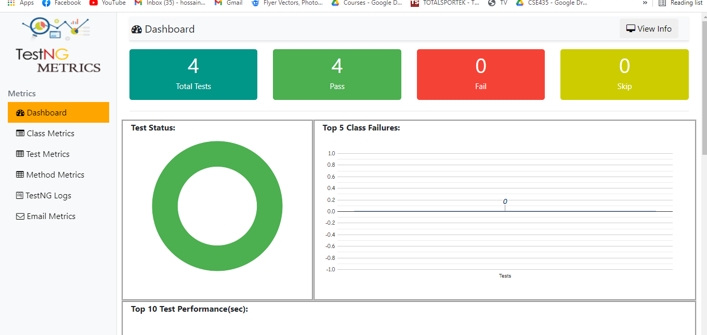
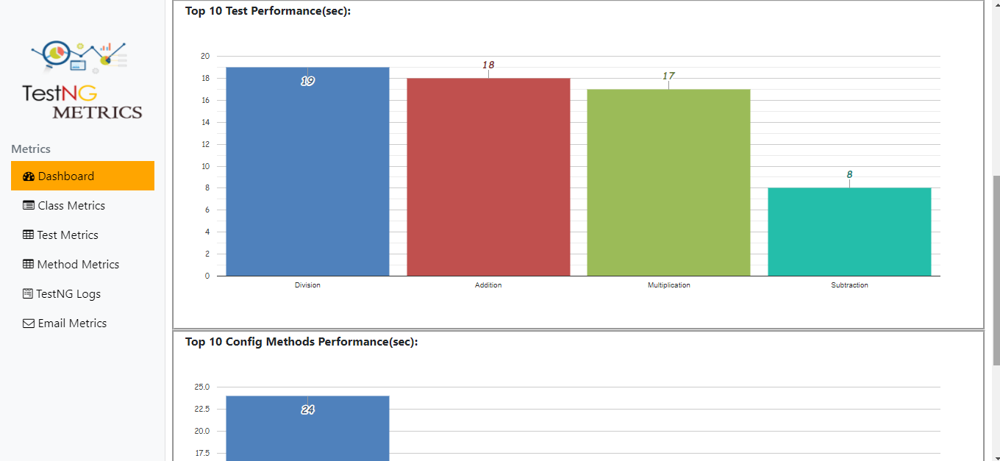
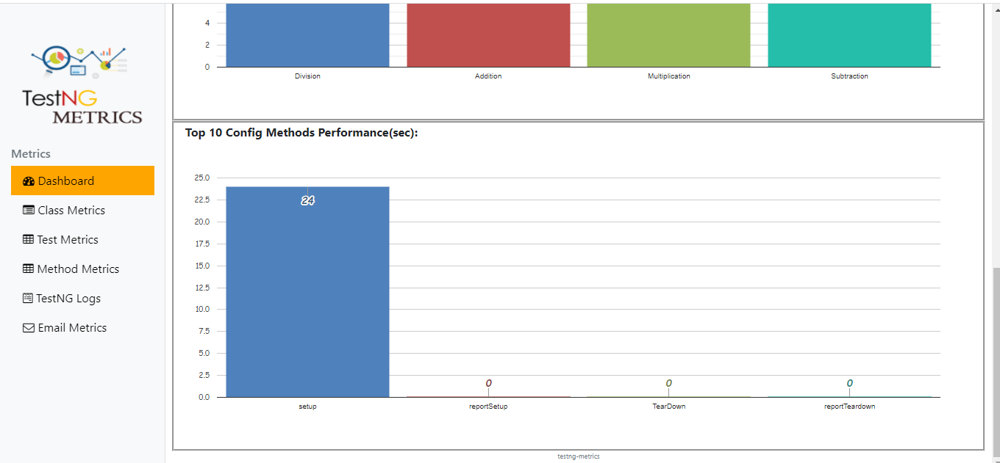

# <h1>Android-Appium-Calculator-App</h1>
## 
 1. Windows Requirements 

-Appium Desktop 1.8.2

-Node v8.12.0 or higher node -v

-npm 6.7.0 or higher npm -v

-Java 1.8.0_181 java -version

-Appium 1.10.0 or higher appium -v

-Android Studio 3.X or higher/SDK Tool manager

### 
<h2>2. Deployment</h2>

To add android mobile phone without cable add this command

* adb devices
* adb kill-server
* adb tcpip 5555
* adb connect (your mobile ip address ex: 199.168.0.209)
* adb devices

😀 Make sure the phone is unlocked

### 
<h2>3. Dependencies</h2>

<!-- https://mvnrepository.com/artifact/io.appium/java-client -->
	<dependency>
		<groupId>io.appium</groupId>
		<artifactId>java-client</artifactId>
		<version>7.0.0</version>
	</dependency>

	<!-- https://mvnrepository.com/artifact/org.seleniumhq.selenium/selenium-java -->
	<dependency>
		<groupId>org.seleniumhq.selenium</groupId>
		<artifactId>selenium-java</artifactId>
		<version>3.141.59</version>
	</dependency>

	<!-- https://mvnrepository.com/artifact/org.testng/testng -->
	<dependency>
		<groupId>org.testng</groupId>
		<artifactId>testng</artifactId>
		<version>6.14.3</version>
		<scope>test</scope>
	</dependency>

	<!-- https://mvnrepository.com/artifact/com.aventstack/extentreports -->
	<dependency>
		<groupId>com.aventstack</groupId>
		<artifactId>extentreports</artifactId>
		<version>4.0.9</version>
	</dependency>
    
	<dependency>
		<groupId>com.github.adiralashiva8</groupId>
		<artifactId>testng-metrics</artifactId>
		<version>1.5</version>
	</dependency>
  
  ### 
<h2>4. How to run this project</h2>

  
  <ul>
			<li>clone the project</li>
			<li>Start the appium server</li>
			<li>Connect mobile device</li>
      <li>Set the debug mode on from mobile device</li>
       <li>Allow connection from phone</li>
        <li>Add those dependencies in POM</li>
        <li>Click Run button</li>
		</ul>
    
    
  ### 
<h2>4. Screenshots</h2>
  
  <h5>1) Test Report</h5>

<h5>2) Test Report</h5>

<h5>3) Test Report</h5>

